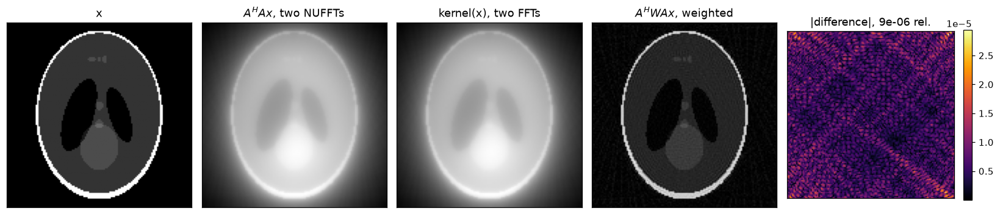
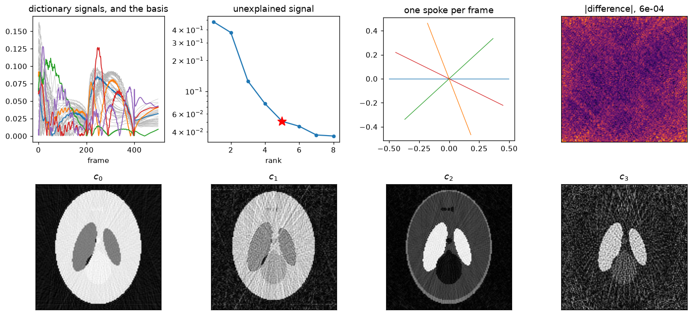
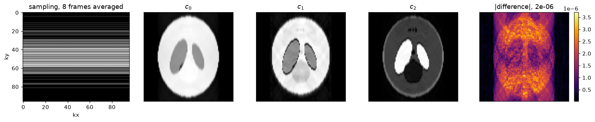
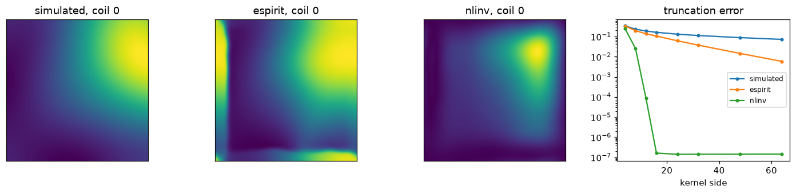
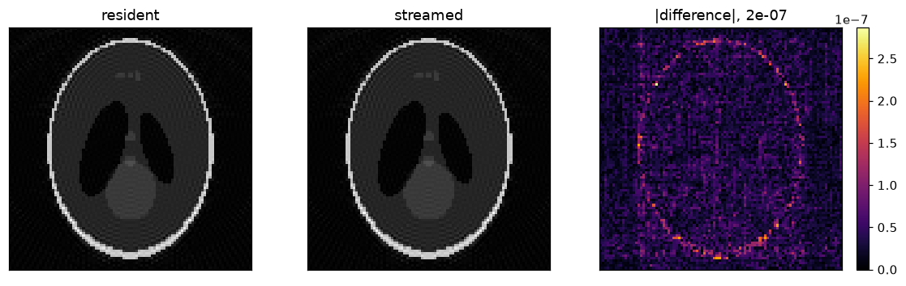
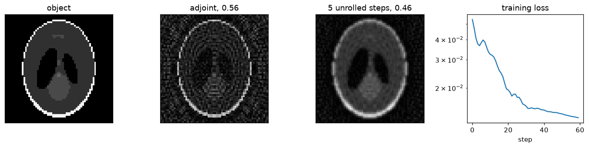

# mrtoeplitz

Memory-efficient Toeplitz normal operators for MRI reconstruction, on CPU and
CUDA.

[](https://github.com/FiRMLAB-Pisa/mrtoeplitz/actions/workflows/test-ci.yml)
[](https://codecov.io/gh/FiRMLAB-Pisa/mrtoeplitz)
[](https://pypi.org/project/mrtoeplitz/)
[](LICENSE)

`AᴴA` for a non-Cartesian encoding is a convolution, so it can be applied as a
pointwise multiply between two FFTs rather than a forward and adjoint NUFFT.
The cost is memory: the transfer lives on a grid twice the image in every
dimension. This package spends accuracy digits to buy that memory back, and
gets as close to the two-FFT floor as it can.

**From the reference implementations** (BART, MRFingerprintingRecon.jl): the
gridded construction, support compression, and the parity decomposition of the
doubled grid — on by default here, so the doubled grid is never materialised.

**Added here:**

- **Low memory by default** — the packed lane, not resident banks on the
  doubled grid, so the operator's footprint stays predictable and the rest of
  a reconstruction keeps its room
- **bfloat16 transfers**, halving what the card holds and what crosses the bus
- **Dual-stream host staging** — a transfer larger than the card stays in
  pinned host memory and arrives in chunks, the copy of one overlapping the
  multiply of the one before
- **Fused apply lanes** — Triton on CUDA, runtime-dispatched AVX2/AVX512 on CPU
- **Coil sensitivities as k-space kernels**, riesling's low-memory idea
- **Differentiable**: the operator is Hermitian, so backward is one more
  application and keeps nothing
- Multi-GPU coil splitting, one gridding plan per build, reused transform banks

Scalar, subspace and Cartesian-subspace transfers, on CPU and CUDA. FINUFFT
and CUFINUFFT are called directly, so a CUDA build never leaves Torch. Applying
a transfer depends on Torch alone.

## Install

```bash
pip install mrtoeplitz          # applying a transfer
pip install mrtoeplitz[nufft]   # building one on the host: FINUFFT
pip install mrtoeplitz[cuda]    # building one on a device: CUFINUFFT
```

## Usage

Trajectories are in normalized k-space: a sample at `-0.5` is grid location
`-kN/2` of a grid of size `kN`. Which library grids the point spread function
follows the trajectory's device, and a transfer moves afterwards with `.to()`.

### A normal operator from a trajectory

```python
import mrtoeplitz as mt

kernel = mt.scalar_kernel(trajectory, image_shape=(256, 256))  # (shots, points, axes)
normal = kernel(image[None, None])  # (batch, rank, *image_shape)
```



[`examples/scalar.ipynb`](examples/scalar.ipynb)

### Subspace

One gridding transform per basis **pair**, over every frame's samples at once.
Frames sharing a trajectory are grouped first.

```python
kernel = mt.subspace_kernel(trajectory, basis, image_shape=(256, 256))
```

`trajectory` is `(shots, points, axes)` when frames share one and
`(frames, shots, points, axes)` when they differ; `basis` is `(frames, rank)`
or its transpose. The frames axis is contrasts for qMRI and time for a dynamic
scan.



[`examples/subspace.ipynb`](examples/subspace.ipynb)

### Cartesian subspace

No gridding and no doubled grid — the normal is the sampling mask itself.

```python
kernel = mt.cartesian_subspace_kernel(masks, basis)
```



[`examples/cartesian.ipynb`](examples/cartesian.ipynb)

### Coil sensitivities

```python
normal = mt.apply_sense(kernel, image, maps)
```

For arrays too large to hold as maps, pass k-space kernels instead. They stand
in for the dense bank — shape, rank and coil slicing all answer as the tensor
would — and only the coils asked for are expanded. At 320³ with 48 channels
that is 12.6 GB of maps against 1.5 MB of kernels.

```python
kernels = mt.CoilKernels.from_maps(maps, kernel_shape=(16, 16, 16))
normal = mt.apply_sense(kernel, image, kernels)
```

Sound when the maps are band-limited; `truncation_error` says whether yours
are.



[`examples/coil_kernels.ipynb`](examples/coil_kernels.ipynb)

### Streaming a transfer that will not fit

The policy is a property of the transfer, so it is given once when the kernel
is built and calling it streams.

```python
policy = mt.CudaStreaming(streams=2)
kernel = mt.scalar_kernel(trajectory, (320, 320, 320), streaming=policy)
normal = kernel(image)
```



[`examples/streaming.ipynb`](examples/streaming.ipynb)

### Gradients

```python
image = torch.randn(1, 1, 256, 256, dtype=torch.complex64, requires_grad=True)
kernel(image).abs().sum().backward()
```



[`examples/unrolled.ipynb`](examples/unrolled.ipynb)

## Benchmark

Peak memory and runtime against the FFT floor, BART,
MRFingerprintingRecon.jl and torchkbnufft, on the Deli-CS 3D
spiral-projection MRF dataset.

*Not yet run — see [`benchmarks/`](benchmarks/).*

## References

The packages this one is measured against, and the work it implements.

- **BART** — <https://mrirecon.github.io/bart/>. `compute_psf_int` is the
  gridded construction used here, and `--nufft-conf compress-psf` the support
  compression.
- **MRFingerprintingRecon.jl** —
  <https://github.com/MagneticResonanceImaging/MRFingerprintingRecon.jl>.
  `calculate_kernel_noncartesian` is the subspace construction.
- Maatman IT, Blumenthal M, Scholand N, Flassbeck S, Uecker M, Assländer J.
  *Memory-Efficient Iterative Subspace Reconstructions on GPUs for
  Non-Cartesian MRI.* ISMRM abstract 508-02-001. Reduces Toeplitz-embedded
  subspace memory ~8× through point-spread-function symmetry and compact
  k-space support, with implementations in BART and Julia.
- ISMRM 2023 — <https://perso.crans.org/comby/ISMRM2023/ISMRM%202023.html>.
  The parity (polyphase) decomposition of the doubled grid, which is the
  default layout here.
- **riesling** — <https://github.com/spinicist/riesling>. Wood TC, Ljungberg E,
  Wiesinger F. *Radial Interstices Enable Speedy Low-volume Imaging.* Journal
  of Open Source Software 6(64), 3500 (2021).
  [doi:10.21105/joss.03500](https://doi.org/10.21105/joss.03500). Its
  low-memory mode is the origin of holding sensitivities as k-space kernels
  rather than as maps.

## Development

```bash
pip install -e .[dev]
bash scripts/format_and_lint.sh
pytest -q
```

See [CONTRIBUTING.md](CONTRIBUTING.md).
