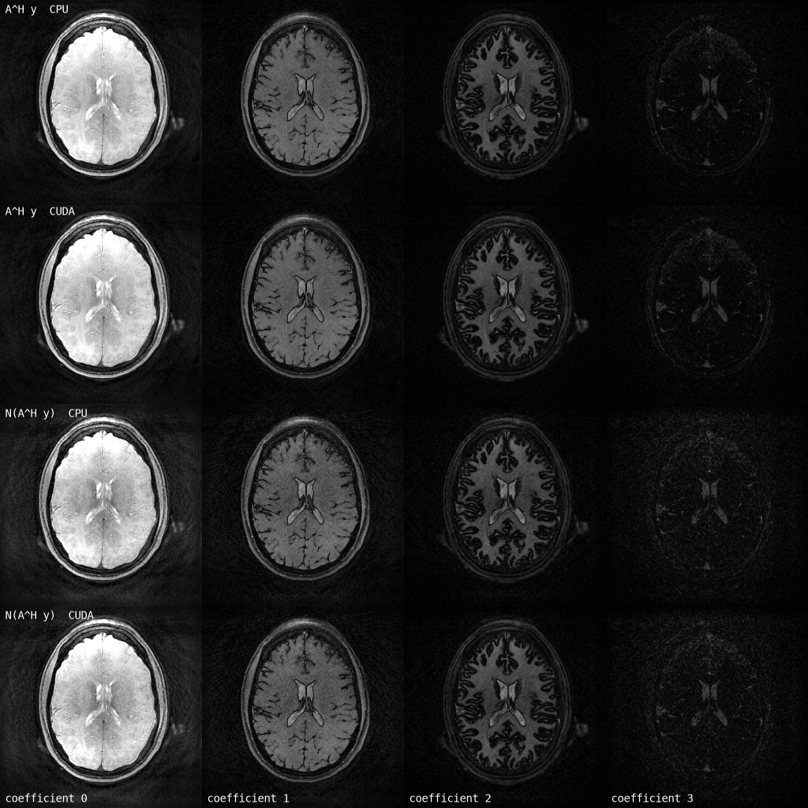

# mrtoeplitz

Memory-efficient Toeplitz normal operators for MRI reconstruction, on CPU and
CUDA.

[](https://github.com/FiRMLAB-Pisa/mrtoeplitz/actions/workflows/test-ci.yml)
[](https://codecov.io/gh/FiRMLAB-Pisa/mrtoeplitz)
[](https://pypi.org/project/mrtoeplitz/)
[](LICENSE)

`AᴴA` for a non-Cartesian encoding is a convolution, so it can be applied as a
pointwise multiply between two FFTs rather than a forward and adjoint NUFFT.
The cost is memory: the transfer lives on a grid twice the image in every
dimension. This package spends accuracy digits to buy that memory back, and
gets as close to the two-FFT floor as it can.

From the reference implementations (BART, MRFingerprintingRecon.jl): the
gridded construction, support compression, and the parity decomposition of the
doubled grid — on by default here, so the doubled grid is never materialised.
Added here:

- **Nothing resident that need not be** — the transfer stays on the host and is
  streamed across in chunks, on the build and the apply alike, so the largest
  thing in a reconstruction never occupies the card
- **bfloat16 transfers**, halving what crosses the bus
- **Coil sensitivities as k-space kernels**, riesling's low-memory idea: one
  map is expanded at a time, never a bank
- **Fused apply lanes** — Triton on CUDA, runtime-dispatched AVX2/AVX512 on CPU
- **Differentiable**: the operator is Hermitian, so backward is one more
  application and keeps nothing
- Scalar, subspace and Cartesian-subspace transfers; multi-GPU coil splitting

FINUFFT and CUFINUFFT are called directly, so a CUDA build never leaves Torch.
Applying a transfer depends on Torch alone.

## Quick Start

```bash
pip install mrtoeplitz          # applying a transfer
pip install mrtoeplitz[nufft]   # building one on the host: FINUFFT
pip install mrtoeplitz[cuda]    # building one on a device: CUFINUFFT
```

Trajectories are in normalized k-space: a sample at `-0.5` is grid location
`-kN/2` of a grid of size `kN`. Which library grids the point spread function
follows the trajectory's device.

```python
import mrtoeplitz as mt

# normal operator from a trajectory, (shots, points, axes)
kernel = mt.scalar_kernel(trajectory, image_shape=(256, 256))
normal = kernel(image[None, None])  # (batch, rank, *image_shape)

# subspace: one gridding transform per basis pair, never one per frame
kernel = mt.subspace_kernel(trajectory, basis, image_shape=(256, 256))

# Cartesian subspace: the sampling mask is the transfer, nothing is gridded
kernel = mt.cartesian_subspace_kernel(masks, basis)

# coil sensitivities, one coil at a time
normal = mt.apply_sense(kernel, image, maps)

# sensitivities as k-space kernels: what NLINV solves for, expanded on demand
coil_kernels = mt.CoilKernels(calibration, image_shape=(320, 320, 320))
normal = mt.apply_sense(kernel, image, coil_kernels)

# dense maps instead: the smallest kernel holding them to a tolerance
coil_kernels = mt.CoilKernels.from_maps(maps, tolerance=1e-3)

# a transfer on the host is streamed; moving it across keeps it there
kernel.to("cuda")

# gradients, for an unrolled network
kernel(image.requires_grad_()).abs().sum().backward()
```

## Examples

| | | |
|---|---|---|
| [`scalar.ipynb`](examples/scalar.ipynb) | a normal operator against the NUFFT pair it replaces | [](https://colab.research.google.com/github/FiRMLAB-Pisa/mrtoeplitz/blob/main/examples/scalar.ipynb) |
| [`subspace.ipynb`](examples/subspace.ipynb) | a subspace normal against the definition | [](https://colab.research.google.com/github/FiRMLAB-Pisa/mrtoeplitz/blob/main/examples/subspace.ipynb) |
| [`cartesian.ipynb`](examples/cartesian.ipynb) | the Cartesian subspace normal | [](https://colab.research.google.com/github/FiRMLAB-Pisa/mrtoeplitz/blob/main/examples/cartesian.ipynb) |
| [`coil_kernels.ipynb`](examples/coil_kernels.ipynb) | sensitivities as k-space kernels | [](https://colab.research.google.com/github/FiRMLAB-Pisa/mrtoeplitz/blob/main/examples/coil_kernels.ipynb) |
| [`streaming.ipynb`](examples/streaming.ipynb) | a streamed transfer against a resident one | [](https://colab.research.google.com/github/FiRMLAB-Pisa/mrtoeplitz/blob/main/examples/streaming.ipynb) |
| [`unrolled.ipynb`](examples/unrolled.ipynb) | gradients through the normal operator | [](https://colab.research.google.com/github/FiRMLAB-Pisa/mrtoeplitz/blob/main/examples/unrolled.ipynb) |

## Benchmark

One application of the subspace normal operator for a 3D spiral-projection MRF
scan, on the [Deli-CS](https://zenodo.org/records/7697373) six-minute
acquisition: 500 frames of 48 shots, 48 channels compressed to 8, rank 4, on a
256³ grid. Four coefficients of `A^H y` and of one normal-operator application
on top of it, at the level of the lateral ventricles.



Neither row is a reconstruction — the operator has no regulariser and does not
converge to anything. What it shows is the operator applied to real data on
both devices, agreeing to `4e-4`, which is what the gridding tolerance allows.

| | RAM | VRAM | `A^H y` | kernel creation | kernel apply |
|---|---|---|---|---|---|
| CPU | 17.9 GiB | — | 57.6 s | 268.4 s | 76.1 s |
| CUDA | 13.3 GiB | 7.7 GiB | 14.9 s | 32.4 s | 7.4 s |
| FFT floor, CUDA | 0.6 GiB | 3.1 GiB | — | — | 2.4 s |
| FFT floor, CPU | 3.5 GiB | — | — | — | 22.8 s |

The floor is what the transforms alone cost: `coils x rank` volumes, one
forward and one inverse each, with the transfer multiply, the sensitivities
and every copy taken as free. Nothing can beat it, and the apply here is 3.1x
of it on the device and 3.3x on the host. The transfer is never resident: it is
3.1 GiB, and it stays on the host and streams.

Creating it costs what it does because the parities are gridded straight onto
the image grid rather than split off a doubled one -- eight times the
spreading, for a build that never makes a grid larger than the image. It is
free on the device and three times the price on the host; either way it needs
the trajectory and the basis and none of the data, so it is built while the
scan is still running.

Regenerate with `python benchmarks/run.py` and `python benchmarks/figure.py`;
see [`benchmarks/`](benchmarks/) for what each lane does. Runtimes are from one
laptop RTX 4060 and are secondary — the memory is the reproducible part.

## Related Works

- **BART** — <https://mrirecon.github.io/bart/>. `compute_psf_int` is the
  gridded construction used here, and `--nufft-conf compress-psf` the support
  compression.
- **MRFingerprintingRecon.jl** —
  <https://github.com/MagneticResonanceImaging/MRFingerprintingRecon.jl>.
  `calculate_kernel_noncartesian` is the subspace construction.
- Maatman IT, Blumenthal M, Scholand N, Flassbeck S, Uecker M, Assländer J.
  *Memory-Efficient Iterative Subspace Reconstructions on GPUs for
  Non-Cartesian MRI.* ISMRM abstract 508-02-001. Reduces Toeplitz-embedded
  subspace memory ~8x through point-spread-function symmetry and compact
  k-space support, with implementations in BART and Julia.
- ISMRM 2023 — <https://perso.crans.org/comby/ISMRM2023/ISMRM%202023.html>.
  The parity (polyphase) decomposition of the doubled grid, which is the
  default layout here.
- **riesling** — <https://github.com/spinicist/riesling>. Wood TC, Ljungberg E,
  Wiesinger F. *Radial Interstices Enable Speedy Low-volume Imaging.* Journal
  of Open Source Software 6(64), 3500 (2021).
  [doi:10.21105/joss.03500](https://doi.org/10.21105/joss.03500). Its
  low-memory mode is the origin of holding sensitivities as k-space kernels
  rather than as maps.
- **Deli-CS** — Iyer S, Schauman SS, Sandino CM, et al. *Deep learning
  initialized compressed sensing (Deli-CS) in volumetric spatio-temporal
  subspace reconstruction.* MAGMA 37, 961-977 (2024).
  [doi:10.1007/s10334-024-01205-3](https://doi.org/10.1007/s10334-024-01205-3).
  The acquisition the benchmark runs on.

## Development

```bash
pip install -e .[dev]
bash scripts/format_and_lint.sh
pytest -q
```

See [CONTRIBUTING.md](CONTRIBUTING.md).
